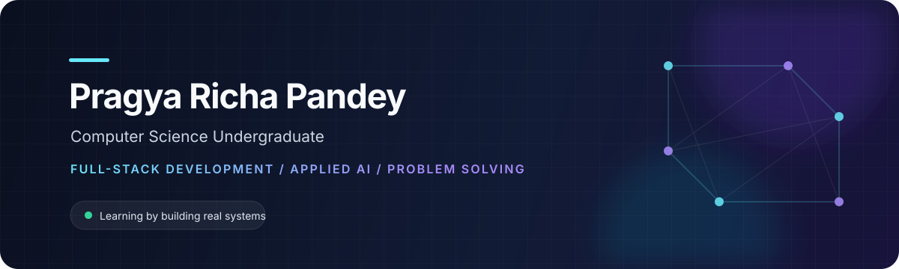

<div align="center">
  
</div>

<br />

## About me

I’m a Computer Science undergraduate who learns best by building. I enjoy working through the complete path from an idea to a usable product—understanding the problem, designing the flow, connecting the backend, and improving the details that make software feel reliable.

Right now, I’m developing my foundations in **full-stack engineering, data structures and algorithms, and applied AI**. I’m especially interested in technology that solves an understandable human problem instead of existing only as a technical demonstration.

- Based in India
- Building with React, FastAPI, Firebase, Python, and Java
- Learning more about backend design, authentication, databases, and responsible AI integration
- Open to student collaborations, hackathons, and meaningful open-source work

## Current direction

```text
build complete products   →   understand the systems behind them
practice core CS          →   write better solutions, not just faster ones
use AI thoughtfully       →   solve a real user problem
share the process         →   learn in public and improve through feedback
```

## Technologies I work with

<div align="center">
  
</div>

## GitHub activity

<div align="center">
  <picture>
    <source media="(prefers-color-scheme: dark)" srcset="https://github-readme-stats.vercel.app/api?username=pragya-pp08&amp;show_icons=true&amp;hide_border=true&amp;bg_color=00000000&amp;title_color=67e8f9&amp;icon_color=a78bfa&amp;text_color=cbd5e1" />
    <source media="(prefers-color-scheme: light)" srcset="https://github-readme-stats.vercel.app/api?username=pragya-pp08&amp;show_icons=true&amp;hide_border=true&amp;bg_color=00000000&amp;title_color=0e7490&amp;icon_color=7c3aed&amp;text_color=334155" />
    
  </picture>
  <picture>
    <source media="(prefers-color-scheme: dark)" srcset="https://github-readme-stats.vercel.app/api/top-langs/?username=pragya-pp08&amp;layout=compact&amp;hide_border=true&amp;bg_color=00000000&amp;title_color=67e8f9&amp;text_color=cbd5e1" />
    <source media="(prefers-color-scheme: light)" srcset="https://github-readme-stats.vercel.app/api/top-langs/?username=pragya-pp08&amp;layout=compact&amp;hide_border=true&amp;bg_color=00000000&amp;title_color=0e7490&amp;text_color=334155" />
    
  </picture>
</div>

## A little more about how I learn

I like breaking large ideas into small, testable parts. When something does not work, I would rather trace the actual user journey and understand the failure than patch the visible symptom. My goal is to keep becoming the kind of engineer who can explain a system clearly, make careful decisions, and finish what she starts.

Outside the code itself, I’m working on stronger technical communication, cleaner documentation, and presenting projects with honesty about what works and what still needs to be built.

## Connect with me

<div align="center">
  <a href="https://www.linkedin.com/in/pragya-richa-pandey-94bbb9308/">
    
  </a>
  <a href="https://github.com/pragya-pp08">
    
  </a>
</div>
